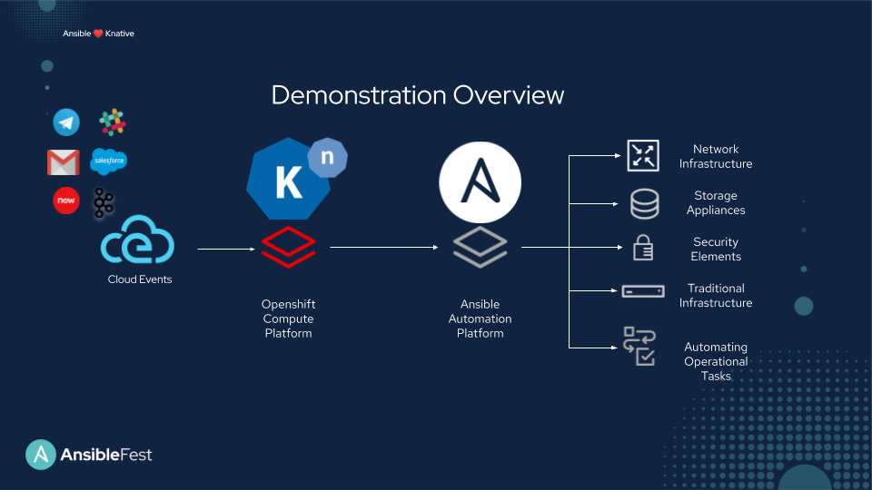

# Ansible AWS Report

Ansible Collection for creating a report with Ansible for AWS (Amazon Web Services).

## Goal

The goal for this Ansible Collection was to provide public cloud operational tasks to show use-cases for event driven automation.  While Ansible can configure Linux hosts, network routers, security firewalls (and pretty much anything!) there is a lot of orchestration for routine troubleshooting, and activities that needs to happen.

This automated operational tasks can help save organizations tons of time.  These are especially helpful for "just in time" or event driven automation.  In this diagram you can see where Knative (OCP Serverless) is really good at providing easy eventing, or trigger off Cloud Events and can integrate seamlessly with the Ansible Automation Platform to help extend the capabilities of both platforms.

Basically imagine an event of your choice from AWS happens.  This can trigger a simple and succinct Ansible Playbook that helps automate the next few things you would have performed manually.  In this case an event retrieves information about every VPC, provides me additional information so I can make informed choices.  

**Imagine**:
- support cases already having all the required information for engineers to begin troubleshooting immediately  
- dynamic documentation, where the information you have is accurate exactly when you need it
- seamless integration with all your infrastructure, combine the best of your container and traditional environments
- self healing infrastructure, where events kick of troubleshooting Ansible Playbooks that rectify issues without human intervention

## Roles

- [vpc_report](vpc_report/README.md) - this role has an example calling it from `build_report.yml` in this directory

## Ansiblefest 2020

Thanks to [William Oliveira](https://github.com/markito) for working with me!

This Ansible Collection was demoed at Ansiblefest 2020 in conjunction with markito's [https://github.com/markito/ansiblefest2020](https://github.com/markito/ansiblefest2020)

## OCP + Ansible

+

