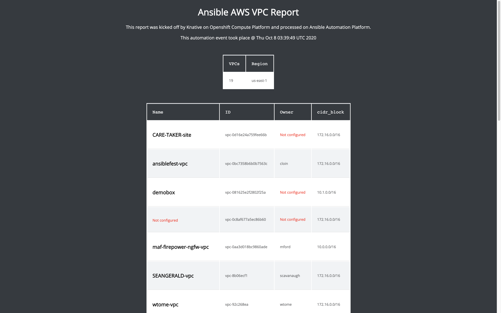

# VPC Report

This Ansible Role uses the `amazon.aws.ec2_vpc_net_info` to retrieve VPC (Virtual Private Cloud) information and template out a simple dynamic HTML website in apache on a specific Red Hat Enterprise Linux host.

Here is an example of calling this role:

```
- name: Ansible AWS report playbook
  hosts: all
  become: false
  gather_facts: false
  vars:
    ec2_region: us-east-1
  tasks:
    - name: get some info
      include_role:
        name: vpc_report
```

## Requirements:

- AWS account and requirements specified on [module documentation](https://docs.ansible.com/ansible/latest/collections/amazon/aws/ec2_vpc_net_info_module.html).  At the time of writing this documentation was:
   - boto
   - boto3
   - botocore
   - python >= 2.6
- a RHEL host for inventory (check the tasks/main.yml to investigate which apache we are using)
- The region you want investigated, e.g. in the example above its `ec2_region: us-east-1`

## Screenshot 
Here is the output of this report:

